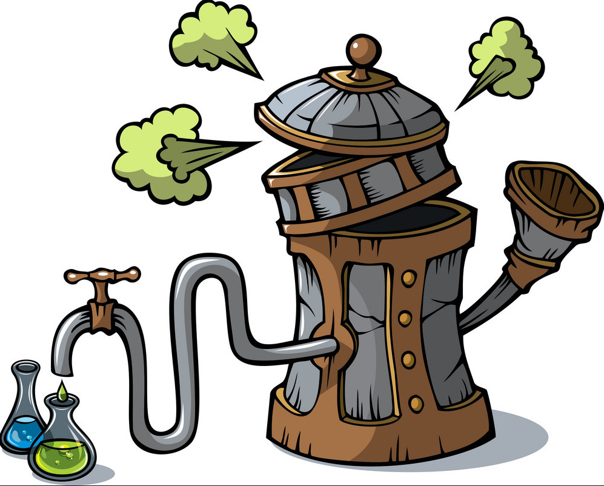

# Distiller

A clean Pytorch implementation to run quick distillation experiments.

## Python Dependencies
This codebase only supports Python 3.6+.

Required Python packages:
- `torch torchvision tqdm numpy pandas seaborn`

All packages can be installed using `pip3 install --user -r requirements.txt`.

This project is also integerated with Pytorch Lightning. Use the lightning branch to see Pytorch Lightning compatible code.

## Run
The benchmarks can be run via `python3 evaluate_kd.py` and providing the
respective command line parameters. For example:

`python3 evaluate_kd.py --epochs 200 --teacher resnet18 --student resnet8  --dataset cifar10 --teacher-checkpoint pretrained/resnet18_cifar10_95260_parallel.pth --mode nokd kd`

Runs basic student training and knowledge distillation for 200 epochs using a
pretrained teacher.

## Supported distillation modes

### NOKD
Do not use knowledge distillation, just train the model.
### KD
Use the normal Hinton loss to distill a student network.
### ALLKD
Parameter Tuning, distill from a list of teacher models and pick the best performing one.
### KDPARAM
Parameter Tuning, distill using varying combinations of temperature and alpha and pick the best performing combination.
### TRIPLET
Knowledge Distillation with a different loss to cross-entropy. Here we use the triplet loss with the student as negative example.
### MULTIKD
Train a student under an ensemble of students that are picked from a list.
### UDA
Run knowledge distillation in combination with [unsupervised data augmentation](https://github.com/google-research/uda).
### TAKD
Run distillation using [Teacher-Assistant](https://github.com/imirzadeh/Teacher-Assistant-Knowledge-Distillation) distillation.
### AB
Run feature distillation using [Activation-Boundary](https://github.com/bhheo/AB) distillation.
### OH
Run feature distillation using the [Feature Overhaul](https://github.com/clovaai/overhaul-distillation) distillation.
### RKD
Run distillation using the [Relational Knowledge](https://github.com/lenscloth/RKD) distillation.
### PKD
Run feature distillation using the [Patient Knowledge](https://github.com/intersun/PKD-for-BERT-Model-Compression) distillation.
### FD
Runs a custom feature distillation distillation that just pools and flattens feature layers.
